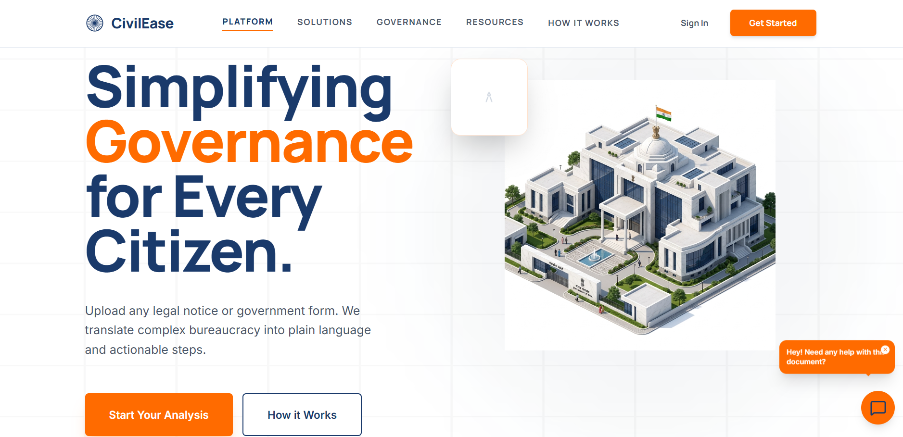

# 🇮🇳 CivilEase: The Digital Diplomat

CivilEase is an AI-powered administrative assistant designed to bridge the gap between complex government procedures and the everyday citizen. By leveraging advanced Large Language Models, it transforms dense legal notices, government forms, and official orders into plain-language summaries and actionable procedural maps.



---

##  Key Features

*   **AI Document Analysis:** Instantly simplify official PDFs or pasted document text.
*   **Interactive Journey Maps:** Visualizes complex bureaucratic paths as clear, step-by-step flowcharts using Mermaid.js.
*   **Multilingual Voice Guidance:** Integrated Web Speech API support for regional language narration (Hindi, Bengali, Telugu, Kannada, Tamil, etc.).
*   **Digital Sovereignty:** Built with privacy-first principles following the DPDP norms, featuring "Fake Auth" UI for demonstration.
*   **Professional PDF Reports:** Generate clean, official document summaries for offline use.

---

## 🛠 Tech Stack

### Frontend
- **Framework:** Next.js 14 (App Router)
- **Styling:** Tailwind CSS (Premium Government Aesthetic)
- **Icons:** Lucide React & Google Material Symbols

### Backend & AI
- **LLM Engine:** Hugging Face Inference API (Mistral-8x7B / Qwen-2.5)
- **PDF Processing:** PDF-Parse
- **Visualization:** Mermaid.js

### Tools & APIs
- **Voice:** Browser Web Speech API
- **Persistence:** LocalStorage for user sessions and document state

---

## 📦 Getting Started

### 1. Prerequisites
- Node.js 18+
- A free **Hugging Face API Token** (for LLM analysis)

### 2. Installation
```bash
git clone https://github.com/your-username/civilease.git
cd civilease
npm install
```

### 3. Environment Setup
Create a `.env.local` file in the root directory:
```env
HF_TOKEN=your_huggingface_token_here
```

### 4. Run Development Server
```bash
npm run dev
```
Open [http://localhost:3000](http://localhost:3000) to view the platform.

---

## 🏛 Governance & Privacy
CivilEase operates as a transparency tool. It is designed to assist in document interpretation and does not replace official legal counsel or represent any government body. All data analysis is session-based and respects citizen privacy.

---
*Generated by CivilEase | Empowering 1.4 Billion Citizens*
